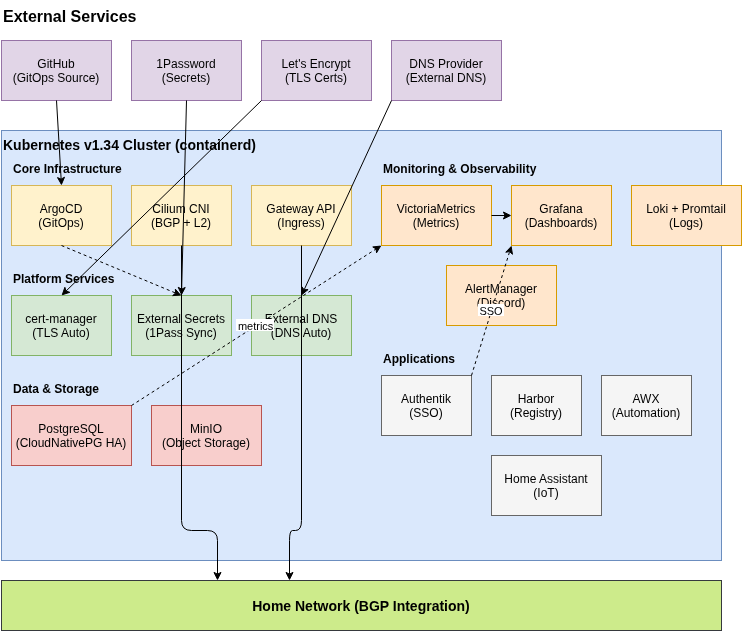

# 🏠 Home Lab Kubernetes

<div align="center">


[](k8s-sandbox/README.md)

A comprehensive home lab Kubernetes setup with GitOps, supporting multiple Linux distributions on VMs and bare metal

</div>

## 🎯 Overview

This repository provides a complete setup guide and configuration for deploying a production-ready Kubernetes cluster in your home lab. The setup supports various Linux distributions and deployment methods including VMs, bare metal servers, and hybrid configurations.

### ✨ Key Features

- � **Multi-Distribution Support** - Works with Arch Linux, Ubuntu, and other distributions
- 🖥️ **Flexible Deployment** - VMs, bare metal, or hybrid setups
- � **Step-by-step Guides** - Detailed installation and configuration
- 🚀 **GitOps Ready** - ArgoCD for automated deployments
- 🔐 **Security First** - Identity management with Authentik
- 🌐 **Advanced Networking** - Cilium CNI with BGP support
- � **Full Observability** - Monitoring, logging, and alerting
- 🏠 **Home Lab Optimized** - Gaming servers, automation, and more

## 🏗️ Architecture



**[View/Edit Interactive Diagram](docs/architecture-diagram.drawio)** - Open in draw.io to modify

### Deployment Options

- **Virtual Machines** - Unraid, Proxmox, VMware, VirtualBox
- **Bare Metal** - Physical servers and workstations  
- **Hybrid Setup** - Mix of VMs and physical nodes

### Recommended Specs

- **Control Plane**: 4 cores, 8GB RAM minimum
- **Worker Nodes**: 2 cores, 4GB RAM minimum per node
- **Storage**: NFS, local storage, or distributed solutions

### 🌟 Included Applications

<table>
<tr>
<td align="center">
  <br/>
  ArgoCD<br/>
  <sub>GitOps Engine</sub>
</td>
<td align="center">
  <br/>
  Cilium<br/>
  <sub>Networking</sub>
</td>
<td align="center">
  <br/>
  Authentik<br/>
  <sub>Identity</sub>
</td>
<td align="center">
  <br/>
  cert-manager<br/>
  <sub>Certificates</sub>
</td>
</tr>
<tr>
<td align="center">
  <br/>
  VictoriaMetrics<br/>
  <sub>Monitoring</sub>
</td>
<td align="center">
  <br/>
  Grafana<br/>
  <sub>Dashboards</sub>
</td>
<td align="center">
  <br/>
  External Secrets<br/>
  <sub>Secrets Management</sub>
</td>
<td align="center">
  <br/>
  n8n<br/>
  <sub>Automation</sub>
</td>
</tr>
<tr>
<td align="center">
  <br/>
  External DNS<br/>
  <sub>DNS Management</sub>
</td>
<td align="center">
  <br/>
  Gateway API<br/>
  <sub>Ingress/Traffic</sub>
</td>
<td align="center">
  <br/>
  NFS Storage<br/>
  <sub>Persistent Volumes</sub>
</td>
</tr>
</table>

See [Applications Directory](k8s-sandbox/apps) for the complete list of available applications.

## 🚀 Getting Started

### Prerequisites
- Linux servers or VMs (Arch Linux, Ubuntu, etc.)
- Minimum 16GB total RAM (32GB+ recommended)
- Network connectivity between nodes
- Basic Linux and Kubernetes knowledge

### Quick Start
```bash
# Clone the repository
git clone https://github.com/Starslider/kubernetes-demo.git
cd kubernetes-demo

# Choose your setup guide:
# For Arch Linux VMs: k8s-sandbox/README.md
# For Ubuntu/other distros: See platform-specific docs
```

📖 **[View Full Installation Guide →](k8s-sandbox/README.md)**

## 📂 Repository Structure

```text
kubernetes-demo/
├── k8s-sandbox/         # Main Kubernetes configurations
│   ├── apps/           # ArgoCD application definitions
│   ├── argocd/         # GitOps setup and configuration
│   ├── monitoring/     # Grafana, VictoriaMetrics, alerts
│   ├── networking/     # Cilium, ingress, DNS
│   ├── security/       # Authentik, cert-manager, secrets
│   └── README.md       # Detailed setup guide
├── flatcar/            # Flatcar Linux specific configs
├── scripts/            # Helper scripts and utilities
└── docs/               # Additional documentation
```

## 🛠️ Development

### Core Stack

**Platform**: Kubernetes, containerd, kubeadm  
**Networking**: Cilium CNI with BGP  
**GitOps**: ArgoCD for automated deployments  
**Security**: Authentik SSO, cert-manager, External Secrets  
**Monitoring**: VictoriaMetrics, Grafana, Prometheus ecosystem  
**Storage**: NFS CSI, local storage options

### Design Principles

- **GitOps First**: All changes tracked and deployed via ArgoCD
- **Security by Default**: Zero-trust networking, encrypted communication
- **Home Lab Optimized**: Cost-effective, power-efficient configurations
- **Production Ready**: High availability and monitoring built-in

## 📚 Documentation

| Component | Description | Link |
|-----------|-------------|------|
| 🚀 **Installation** | Complete setup guide | [k8s-sandbox/README.md](k8s-sandbox/README.md) |
| 📦 **Applications** | Available apps and configs | [k8s-sandbox/apps/](k8s-sandbox/apps/) |
| 🔄 **GitOps** | ArgoCD setup and usage | [k8s-sandbox/argocd/](k8s-sandbox/argocd/) |
| 🌐 **Networking** | Cilium and network policies | [k8s-sandbox/cilium/](k8s-sandbox/cilium/) |

## 🤝 Contributing

Contributions are welcome! Please read our [Contributing Guidelines](CONTRIBUTING.md) first.

1. Fork the repository
2. Create your feature branch
3. Commit your changes
4. Push to the branch
5. Create a Pull Request

## 📝 License

This project is licensed under the MIT License - see the [LICENSE](LICENSE) file for details.

## 🙏 Acknowledgments

- [Kubernetes Documentation](https://kubernetes.io/docs/) - Official K8s docs
- [CNCF Projects](https://cncf.io/) - Cloud native ecosystem
- [Home Lab Community](https://www.reddit.com/r/homelab/) - Inspiration and support

---

<div align="center">

Made with ❤️ by [Starslider](https://github.com/Starslider)

<sub>If you find this project helpful, please consider giving it a ⭐️</sub>

</div>